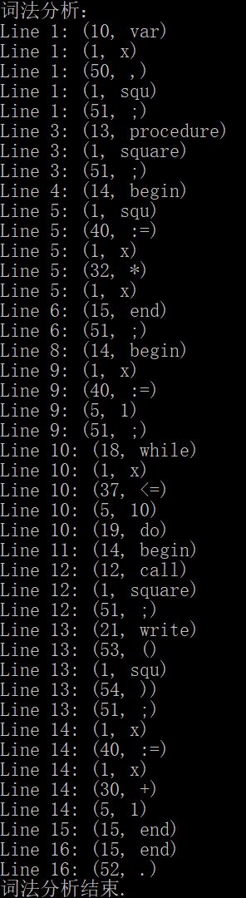
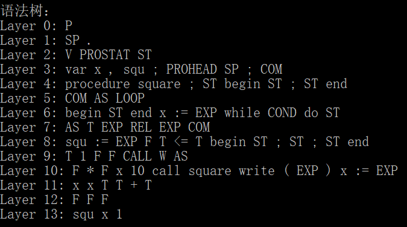
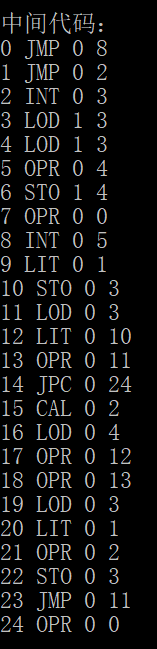
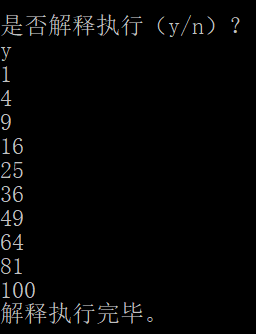

# PL0_Compiler
编译原理与技术的课程实验，实现一个对PL/0语言的编译器。
  
本实验基于“编译原理实习题.pdf”的要求实现，并额外添加了语法树的相关实现。
以下内容几乎直接copy实验报告，较为啰嗦，请见谅。
_____________________________

## 一. 代码总述

1. 头文件`utilities.h`
   其中定义了编译器需要使用的所有函数，并对需要在不同文件中共享的变量进行了extern声明。
2. 词法分析实现文件`lexer.cpp`
   其中对`utilities.h`中定义的用于词法分析的函数进行了实现，并且定义了在词法分析过程中需要使用到的诸多辅助变量。
3. 语法分析、语法树产生、目标代码产生实现文件`parser.cpp`
   其中对`utilities.h`中定义的用于语法分析、语法树产生、目标代码产生的函数进行了实现，并且定义了在上述过程中需要使用到的诸多辅助变量。
4. 解释执行实现文件`interpreter.cpp`
   其中对`utilities.h`中定义的用于解释执行的函数进行了实现，并且定义了在解释执行过程中需要使用到的诸多辅助变量。
5. 程序总执行文件`PL0_Compiler.cpp`
   该文件中包含`main`函数，是整个PL0编译器的控制部分。

## 二. 词法分析

### 1. 要求：实现`GETSYM()`函数，将token读入到以下三个变量中。

1. `SYM`：存放每个单词的类别，为内部编码的表示形式。
2. `ID`：存放用户所定义的标识符的值，即标识符字符串的机内表示。
3. `NUM`：存放用户定义的数。

```cpp
symType SYM;	// 类型 
string ID;	// 标识符名称 
int NUM;	// 用户定义的数 
```

其中的`symType`是枚举的编码，见如下符号编码。

### 2. 符号编码

为实现对读入的token的表示和存储，需要将token映射到不同的编码上。

1. 特殊编码

| 类型       | 编码   | 编码值 |
| ---------- | ------ | ------ |
| 错误标识符 | ERROR  | 0      |
| 数字标识符 | NUMBER | 5      |

2. 关键字

| 符号      | 编码         | 编码值 |
| --------- | ------------ | ------ |
| var       | VARSYM       | 10     |
| const     | CONSTSYM     | 11     |
| call      | CALLSYM      | 12     |
| procedure | PROCEDURESYM | 13     |
| begin     | BEGINSYM     | 14     |
| end       | ENDSYM       | 15     |
| if        | IFSYM        | 16     |
| then      | THENSYM      | 17     |
| while     | WHILESYM     | 18     |
| do        | DOSYM        | 19     |
| read      | READSYM      | 20     |
| write     | WRITESYM     | 21     |

3. 运算符

| 符号 | 编码            | 编码值 |
| ---- | --------------- | ------ |
| +    | PLUSSYM         | 30     |
| -    | MINUSSYM        | 31     |
| *    | MULTIPLYSYM     | 32     |
| /    | DIVIDESYM       | 33     |
| =    | EQUALSYM        | 34     |
| <>   | NOTEQUALSYM     | 35     |
| <    | LESSSYM         | 36     |
| <=   | LESSEQUALSYM    | 37     |
| >    | GREATER         | 38     |
| >=   | GREATEREQUALSYM | 39     |
| :=   | ASSIGNSYM       | 40     |

4. 界符

| 符号 | 编码             | 编码值 |
| ---- | ---------------- | ------ |
| ,    | COMMASYM         | 50     |
| ;    | SEMICOLONSYM     | 51     |
| .    | PERIODSYM        | 52     |
| (    | LEFTPARENTHESIS  | 53     |
| )    | RIGHTPARENTHESIS | 54     |

5. 标识符

| 符号             | 编码  | 编码值 |
| ---------------- | ----- | ------ |
| 用户自定义标识符 | IDENT | 1      |

这些编码通过枚举类型进行定义，实现编码与编码值之间的关联。

```cpp
enum symType { 
	ERROR = 0,   // 错误类型 
	IDENT = 1,   // 标识符 
	NUMBER = 5,   // 数字 
	VARSYM = 10, CONSTSYM, CALLSYM, PROCEDURESYM, BEGINSYM, ENDSYM, IFSYM, THENSYM, WHILESYM, DOSYM, READSYM, WRITESYM, // 关键字 
	PLUSSYM = 30, MINUSSYM, MULTIPLYSM, DIVIDESYM, EQUALSYM, NOTEQUALSYM, LESSSYM, LESSEQUALSYM, GREATER, GREATEREQUALSYM, ASSIGNSYM,  // 算符 
	COMMASYM = 50, SEMICOLONSYM, PERIODSYM, LEFTPARENTHESIS, RIGHTPARENTHESIS    // 界符 
}; 
```

对于符号与编码和编码值之间的关联，借助`map`实现`string`到`symType`的映射。

```cpp
// 通过map将类型直接映射到编码
map<string, symType> keyType = { {"var", symType::VARSYM}, {"const", symType::CONSTSYM}, {"call", symType::CALLSYM},
	{"procedure", symType::PROCEDURESYM}, {"begin", symType::BEGINSYM}, {"end", symType::ENDSYM}, {"if", symType::IFSYM},
	{"then", symType::THENSYM}, {"while", symType::WHILESYM}, {"do", symType::DOSYM}, {"read", symType::READSYM}, {"write", symType::WRITESYM} };
map<string, symType> opeType = { {"+", symType::PLUSSYM}, {"-", symType::MINUSSYM}, {"*", symType::MULTIPLYSM}, {"/", symType::DIVIDESYM},
	{"=", symType::EQUALSYM}, {"<>", symType::NOTEQUALSYM}, {"<", symType::LESSSYM}, {"<=", symType::LESSEQUALSYM},
	{">", symType::GREATER}, {">=", symType::GREATEREQUALSYM}, {":=", symType::ASSIGNSYM} };
map<char, symType> boundType = { {',', symType::COMMASYM}, {';', symType::SEMICOLONSYM}, {'.', symType::PERIODSYM},
	{'(', symType::LEFTPARENTHESIS}, {')', symType::RIGHTPARENTHESIS} };
```

### 3. `GETSYM()`实现

通过字符串的处理，将每个读入的token转为以上编码储存和使用，便可以实现`GETSYM()`函数。  
代码的读入是通过`getline()`函数实现的，每次读入一行代码，之后通过字节流对代码进行分割，然后在`GETSYM()`函数中对分割后的单词进行判断。

```cpp
void GETSYM()
{
	if (words.empty()) {
		if (!(strCin >> words)) {
			strCin.clear();
			while (getline(inFile, str)) {
				line++;
				if (!str.empty())
					break;
			}
			strCin.str(str);
			strCin >> words;
		}
	}

	//关键字肯定是单独作为一个单词的
	if (isKeywords(words))
	{
		SYM = keyType[words];
		cout << "Line " << line << ": (" << SYM << ", " << words << ")" << endl;
		words = "";
		return;
	}

	//非关键字：关键字，标识符，运算符，界符等混合在一起的单词
	//修改为每次只处理一个token
	int i = 0;
	//判断是否是关键字+界符的形式，如"write("
	if (words[i] >= 'a' && words[i] <= 'z') {
		int len = 1;
		while (words[len] >= 'a' && words[len] <= 'z')
			len++;
		if (isKeywords(words.substr(0, len))) {
			if (isBound(words[len])) {
				SYM = keyType[words.substr(0, len)];
				cout << "Line " << line << ": (" << SYM << ", " << words.substr(0, len) << ")" << endl;
				words = words.substr(len);
				return;
			}
			else {
				lexicalError();
				return;
			}
		}
	}
	//判断是否是两位的运算符，比如"<=", ">=", "<>", ":="
	if ((i < words.length() - 1) && isOperator(words.substr(i, 2))) {
		SYM = opeType[words.substr(i, 2)];
		cout << "Line " << line << ": (" << SYM << ", " << words.substr(i, 2) << ")" << endl;
		words = words.substr(2);
	}
	//判断是否是一位的运算符，比如+, -等
	else if (isOperator(words.substr(i, 1))) {
		SYM = opeType[words.substr(i, 1)];
		cout << "Line " << line << ": (" << SYM << ", " << words[i] << ")" << endl;
		words = words.substr(1);
	}
	//判断是否是界符
	else if (isBound(words[i])) {
		SYM = boundType[words[i]];
		cout << "Line " << line << ": (" << SYM << ", " << words[i] << ")" << endl;
		words = words.substr(1);
	}
	//判断是否是数字
	else if (words[i] >= '0' && words[i] <= '9') {
		int len = 1;
		while (i + 1 < words.length() && words[i + 1] >= '0' && words[i + 1] <= '9') {
			len++;
			i++;
		}
		if (i + 1 < words.length()) {
			char next = words[i + 1];
			if ((next >= 'a' && next <= 'z') || next == ':' || next == '(') {	//数字后面不可能跟字母、赋值号:=、左括号(
				lexicalError();
				return;
			}
		}
		SYM = NUMBER;
		NUM = stoi(words.substr(i - len + 1, len));
		cout << "Line " << line << ": (" << SYM << ", " << words.substr(i - len + 1, len) << ")" << endl;
		words = words.substr(i + 1);
	}
	//判断是否是标识符
	else if (words[i] >= 'a' && words[i] <= 'z') {
		int len = 1;
		while (i + 1 < words.length() && ((words[i + 1] >= '0' && words[i + 1] <= '9') || (words[i + 1] >= 'a' && words[i + 1] <= 'z'))) {
			len++;
			i++;
		}

		ID = words.substr(i - len + 1, len);
		SYM = IDENT;
		cout << "Line " << line << ": (" << SYM << ", " << ID << ")" << endl;
		words = words.substr(i + 1);
	}
}
```

#### 4. 词法分析示例

以“PL0_code2.in”为例，`GETSYM()`过程获得的代码如下所示。  
最左侧标注该token在源文件中所在的行数，括号中左侧为该token的编码，右侧为token名称。
  

## 三. 语法分析

### 1. 语法分析使用自上而下的递归实现，根据`PL/0`代码的文法执行相应的函数，因此首先需要将文法转为对应的函数。

1.  每项的代码表示

| **term**       | **code** |
| -------------- | -------- |
| <程序>         | P        |
| <分程序>       | SP       |
| <常量说明部分> | CSTAT    |
| <常量定义>     | CDEF     |
| <无符号整数>   | UN       |
| <变量说明部分> | V        |
| <标识符>       | IDF      |
| <过程说明部分> | PROSTAT  |
| <过程首部>     | PROHEAD  |
| <语句>         | ST       |
| <赋值语句>     | AS       |
| <复合语句>     | COM      |
| <条件>         | COND     |
| <表达式>       | EXP      |
| <项>           | T        |
| <因子>         | F        |
| <加减运算符>   | PM       |
| <乘除运算符>   | MD       |
| <关系运算符>   | REL      |
| <条件语句>     | CONDSTAT |
| <过程调用语句> | CAL      |
| <当型循环语句> | LOOP     |
| <读语句>       | R        |
| <写语句>       | W        |
| <字母>         | AZ       |
| <数字>         | N        |
| <空>           | NU       |

2. 整体文法的代码表示

| BNF                                                          | 代码                                        |
| ------------------------------------------------------------ | ------------------------------------------- |
| <程序> → <分程序>.                                           | P → SP.                                     |
| <分程序> → \[<常量说明部分>\]\[<变量说明部分>\]\[<过程说明部分>\]<语句> | SP → \[CSTAT\]\[V\]\[PROSTAT\]ST            |
| <常量说明部分> → CONST<常量定义>{ ,<常量定义>};              | CSTAT → CONST CDEF{,CDEF};                  |
| <常量定义> → <标识符>=<无符号整数>                           | CDEF → IDF=UN                               |
| <无符号整数> → <数字>{<数字>}                                | UN → N{N}                                   |
| <变量说明部分> → VAR<标识符>{ ,<标识符>};                    | V → VAR IDF{,IDF};                          |
| <标识符> → <字母>{<字母>\|<数字>}                            | IDF → AZ{AZ\|N}                             |
| <过程说明部分> → <过程首部><分程序>;{<过程说明部分>}         | PROSTAT → PROHEAD SP;{PROSTAT}              |
| <过程首部> → procedure<标识符>;                              | PROHEAD → procedure IDF;                    |
| <语句> → <赋值语句>\|<条件语句>\|<当型循环语句>\|<过程调用语句>\|<读语句>\|<写语句>\|<复合语句>\|<空> | ST → AS\|CONDSTAT\|LOOP\|CAL\|R\|W\|COM\|NU |
| <赋值语句> → <标识符>:=<表达式>                              | AS → IDF:=EXP                               |
| <复合语句> → begin<语句>{ ;<语句>}end                        | COM → begin ST{;ST}end                      |
| <条件> → <表达式><关系运算符><表达式>\|odd<表达式>           | COND → EXP REL EXP\|odd EXP                 |
| <表达式> → \[+\|-\]<项>{<加减运算符><项>}                     | EXP → \[+\|-\]T{PM T}                        |
| <项> → <因子>{<乘除运算符><因子>}                            | T → F{MD F}                                 |
| <因子> → <标识符>\|<无符号整数>\|(<表达式>)                  | F → IDF\|UN\|(EXP)                          |
| <加减运算符> → +\|-                                          | PM → +\|-                                   |
| <乘除运算符> → \*\|/                                          | MD → \*\|/                                   |
| <关系运算符> → =\|<>\|<\|<=\|>\|>=                           | REL → =\|<>\|<\|<=\|>\|>=                   |
| <条件语句> → if<条件>then<语句>                              | CONDSTAT → if COND then ST                  |
| <过程调用语句> → call<标识符>                                | CAL → call IDF                              |
| <当型循环语句> → while<条件>do<语句>                         | LOOP → while COND do ST                     |
| <读语句> → read(<标识符>{ ，<标识符>})                       | R → read(IDF{,IDF})                         |
| <写语句> → write(<表达式>{，<表达式>})                       | W → write(EXP{,EXP})                        |
| <字母> → a\|b\|c...y\|z                                      | AZ → a\|b\|c...y\|z                         |
| <数字> → 0\|1\|2...8\|9                                      | N → 0\|1\|2...8\|9                          |

### 2. 递归下降分析程序实现

根据上述文法转换成的函数调用关系实现各函数即可，由于函数过多，此处不依次展示，请参照`parser.cpp`中的代码注释。  
此外，由于在此过程中还需要实现语法树的产生和目标代码生成，因此在递归下降实现的各部分函数中还需要附加额外的处理代码。  

```cpp
void P();		// P -> SP.
void SP();		// SP -> [CSTAT][V][PROSTAT]ST
void CSTAT();		// CSTAT -> const CDEF{,CDEF};
void CDEF();		// CDEF -> IDF=UN
void V();		// var IDF{,IDF};
void PROSTAT();		// PROSTAT -> PROHEAD SP;{PROSTAT}
void PROHEAD();		// procedure IDF;
void ST();		// ST -> AS|CONDSTAT|LOOP|CALL|R|W|COM|NU
void AS();		// AS -> IDF:=EXP
void COM();		// COM -> begin ST{;ST}end
void COND();		// COND -> EXP REL EXP
void EXP();		// EXP -> [+|-]T{PM T}
void T();		// T -> F{MD F}
void F();		// F -> IDF|UN|(EXP)
symType REL();		// REL -> =|<>|<|<=|>|>=
void CONDSTAT();	// CONDSTAT -> if COND then ST
void CALL();		// CALL -> call IDF
void LOOP();		// LOOP -> while COND do ST
void R();		// R -> read(IDF{,IDF})
void W();		// W -> write(EXP{,EXP})
```

### 3. 设计符号表

在语法分析过程中需要使用符号表，记录常量、变量和过程的相关信息。符号表的属性类型定义如下。

```cpp
// 符号表的类型
struct sym {
	string name;	// 名字
	int type;	// 类型
	int val;	// 标识符的值或过程的入口地址
	int level;	// 层次
	int address;	// 地址
	int size;	// 当标识符是过程名时，记录形参个数
};
```

### 4. 符号表的填写。

在获得变量、常量和过程时，需要将相应的信息填入符号表中。  
由于这些符号可能已经存在，因此需要定义多个辅助函数查找、判断符号的相应信息。  
在填写符号表时，需要记录层次、偏移量等信息。层次可以定义全局变量，在声明函数时累加，离开函数时恢复，偏移量需要在定义变量等信息时累加。具体可见parser.cpp的代码注释。  

```cpp
// 符号表中的类型
const int CONSTANT = 0;		// 常量
const int VARIABLE = 1;		// 变量
const int PROCEDURE = 2;	// 过程

sym symTable[1000];		// 建立一个一维数组记录syms
int tx = 0;			// symTable的指针
int dx;				// 每层的局部变量的相对地址
int lev;
```

## 四. 语法树产生

### 1. 语法树的产生

语法分析通过递归下降分析实现，在此过程中会隐含地产生语法树。

### 2. 记录语法树

只需要在语法分析过程中记录每层获取的符号和调用的函数，便可以模拟记录调用过程产生的语法树。  
由于语法树的构建过程与语法分析是同步的，因此语法树的产生过程代码在语法分析的递归下降过程代码中。

### 3. 语法树的存储类型

语法树的信息被存在自定义的`treeNode`类型中，该类型中记录了调用节点的名称`name`和其调用的子节点，并通过`vector`储存。  

```cpp
struct treeNode {		// 语法树节点
	treeNode(string nam = "") {
		name = nam;
		children.clear();
	}
	string name;
	vector<treeNode*> children;
};
```

### 4. 语法树的输出

使用层次遍历，输出语法树，即可得到一棵从上到下递归产生的语法树。

```cpp
void displayTree()
{
	int layer = 0;
	queue<treeNode*> q;
	q.push(root);
	while (!q.empty()) {
		int sz = q.size();
		cout << "Layer " << layer << ": ";
		while (sz--) {
			treeNode* temp = q.front();
			q.pop();
			cout << temp->name << ' ';
			for (int i = 0; i < temp->children.size(); i++)
				q.push(temp->children[i]);
		}
		cout << endl;
		layer++;
	}
}
```

以“PL0_code2.in”为例，产生的语法树如下所示：  
  

## 五. 目标代码产生

### 1. 目标代码的格式

`PL/0`语言的目标指令格式为f l a，f代表功能码，l代表层次差，a代表位移量。  
功能码共有8种，代表不同的功能。  

### 2. 目标代码的功能与编码方式

结合功能码f，定义对应的功能与编码方式如下：

```cpp
const int LIT = 0;		// 将常数放到运栈顶，a域为常数。
const int LOD = 1;		// 将变量放到栈顶。a域为变量所在说明层中的相对位置，l为调用层与说明层的层差值。
const int STO = 2;		// 将栈顶的内容送到某变量单元中。a,l域的含义与LOD的相同。
const int CAL = 3;		// 调用过程的指令。a为被调用过程的目标程序的入口地址，l为层差。
const int INT = 4;		// 为被调用的过程或主程序在运行栈中开辟数据区。a域为开辟的个数。
const int JMP = 5;		// 无条件转移指令，a为转向地址。
const int JPC = 6;		// 条件转移指令，当栈顶的布尔值为非真时，转向a域的地址，否则顺序执行。
const int OPR = 7;		// 关系和算术运算。具体操作由a域给出，运算对象为栈顶和次栈顶的内容，结果放在次栈顶。a域为0时退出数据区。
```

### 3. `OPR`指令中a域的功能定义

`OPR`指令中，具体的操作由a域的值指出，定义a域的值和对应操作如下。

```cpp
// a域的取值及含义
// 0：过程返回或程序结束
// 1：取负数
// 2：加法
// 3：减法
// 4：乘法
// 5：除法
// 6：判断相等
// 7：判断不等
// 8：判断小于
// 9：判断不小于
// 10：判断大于
// 11：判断不大于
// 12：输出栈顶内容
// 13：输出换行
// 14：读入
```

### 4. 目标代码的产生函数`gen()`

`gen()`产生的目标代码由参数决定，参数在语法分析过程中由递归下降的过程函数传入。  

```cpp
void gen(int f, int l, int a)	// 中间代码生成函数
{
	CODE[cx].f = f;
	CODE[cx].l = l;
	CODE[cx].a = a;
	cx++;
}
```

### 5. 目标代码示例

以“PL0_code2.in”为例，产生的目标代码如下：  
  

## 六. 解释执行

### 1. 解释执行的基础

解释执行需要设置寄存器和数据栈，用于存储解释执行过程中需要的指令和数据信息。

```cpp
codeType REG_I;		//指令寄存器REG_I，存放当前要执行的代码
int REG_P = 0;		//程序地址寄存器REG_P，存放下一条要执行的指令的地址
int REG_T = 0;		//栈顶指示寄存器REG_T
int REG_B = 0;		//基址寄存器REG_B，存放当前运行过程的数据区在STACK中的起始地址
int dataStack[1000];
```

### 2. 解释执行需要的编码设置

解释执行过程中，使用`switch-case`语句根据不同的指令进行跳转，指令的编码方式与“目标代码产生”中相同。  
此外，由于`OPR`指令需要根据a域的值判断具体的操作，因此内部也需要使用`switch-case`语句跳转，a域的编码也与“目标代码产生”中相同。  

### 3. 解释执行的实现

1. `LIT l a`. 将常数放到运栈顶，a域为常数。
   将a放到栈顶即可。
2. `LOD l a`. 将变量放到栈顶。a域为变量所在说明层中的相对位置，l为调用层与说明层的层差值。
   首先利用`getBase()`函数获得指定层差的基地址，然后与a域表示的偏移量相加获得变量的位置，将其放到栈顶。
3. `STO l a`. 将栈顶的内容送到某变量单元中。a, l域的含义与LOD的相同。
   与LOD过程相反。
4. `CAL l a`. 调用过程的指令。a为被调用过程的目标程序的入口地址，l为层差。
   每个过程被调用时，在栈顶分配三个联系单元。这三个单元的内容分别是：
   - SL：静态链，它是指向定义该过程的直接外过程运行时数据段的基地址。
   - 动态链，它是指向调用该过程前正在运行过程的数据段的基地址。
   - RA：返回地址，记录调用该过程时目标程序的断点，即当时的程序地址寄存器P的值。
5. `INT l a`. 为被调用的过程或主程序在运行栈中开辟数据区。a域为开辟的个数。
   增加栈顶指示寄存器`REG_T`的值代表开辟数据空间。
6. `JMP l a`. 无条件转移指令，a为转向地址。
   将要转向的地址a赋值给程序地址寄存器`REG_P`。
7. `JPC l a`. 条件转移指令，当栈顶的布尔值为非真时，转向a域的地址，否则顺序执行。
   当栈顶非真时，才进行跳转。
8. `OPR l a`. 关系和算术运算。具体操作由a域给出，运算对象为栈顶和次栈顶的内容，结果放在次栈顶。a域为0时退出数据区。
   由于`OPR`指令的举止执行操作由a域给出，因此借助`switch-case`语句根据a域的不同取值转向不同的操作功能。

### 4. 解释执行示例

以“PL0_code2.in”为例，解释执行的结果如下图所示。  
可以看到该程序实现了输出从1到10的每个数的平方的功能。  
  

  
